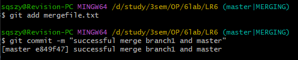
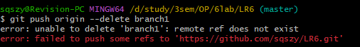

# Отчёт о лабораторной работе №6 по курсу "Основы программирования"
## Цель лабораторной работы
изучение базовых возможностей системы управления версиями, опыт работы с Git Api, опыт работы с локальным и удаленным репозиторием. 

## Ход работы
Регистрация на GitHub

Форк репозитория

Установка Git-Bash. Настройка и клонирование репозитория

добавлен файл fileLR6 через сайт GitHub

Подтянуты изменения в локальный репозиторий

Получена история операций для ветки *master* 

И для ветки *branch1*

Посмотрены последние изменения для ветки *master* 

И для ветки *branch1*

Выполнено слияние ветки branch1 в ветку master

Получен конфликт слияния

Разрешенный конфликт слияния

Удаление побочной ветки

Подтверждение удаления

